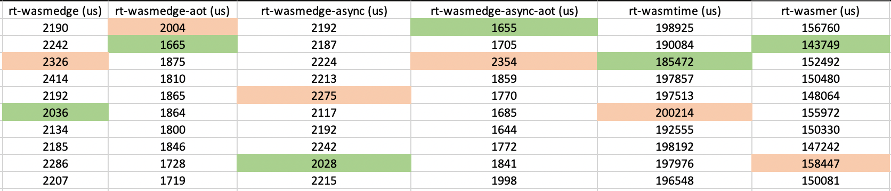

# WasmEdge Rust vs. Wasmtime vs. Wasmer

## Test Environment

- OS: macOS 12.3.1
- Hardware: Apple M1 Pro + 32GB RAM
- Rust: 1.67.0-nightly (215e3cd21 2022-11-03)

## Statistics of time cost of 1000*10000 times fib(30)



- The best of 10 samples of `rt-wasmedge`
  
  ```bash
  time cost create result: 0 us
  time cost intialize config: 89 us
  time cost create vm: 238 us
  time cost call 1000*10000 times fib(30): 2036 us
  ```

- The best of 10 samples of `rt-wasmedge-aot`
  
  ```bash
  time cost create result: 0 us
  time cost intialize config: 64 us
  time cost create vm: 198 us
  time cost call 1000*10000 times fib(30): 1665 us
  ```

- The best of 10 samples of `rt-wasmedge-async`
  
  ```bash
  time cost create result: 0 us
  time cost intialize config: 56 us
  time cost create vm: 176 us
  time cost call 1000*10000 times fib(30): 2028 us
  ```

- The best of 10 samples of `rt-wasmedge-async-aot`
  
  ```bash
  time cost create result: 0 us
  time cost intialize config: 54 us
  time cost create vm: 150 us
  time cost call 1000*10000 times fib(30): 1655 us
  ```

- The best of 10 samples of `rt-wasmtime`
  
  ```bash
  time cost create linker: 184376 us
  time cost build wasi: 184703 us
  time cost create store: 184779 us
  time cost intialize instance: 184979 us
  time cost call 1000*10000 times fib(30): 185472 us
  ```

- The best of 10 samples of `rt-wasmer`
  
  ```bash
  time cost create store: 941 us
  time cost compile module: 141817 us
  time cost creating WasiEnv: 142364 us
  time cost load module: 143528 us
  time cost call 1000*10000 times fib(30): 143749 us
  ```
